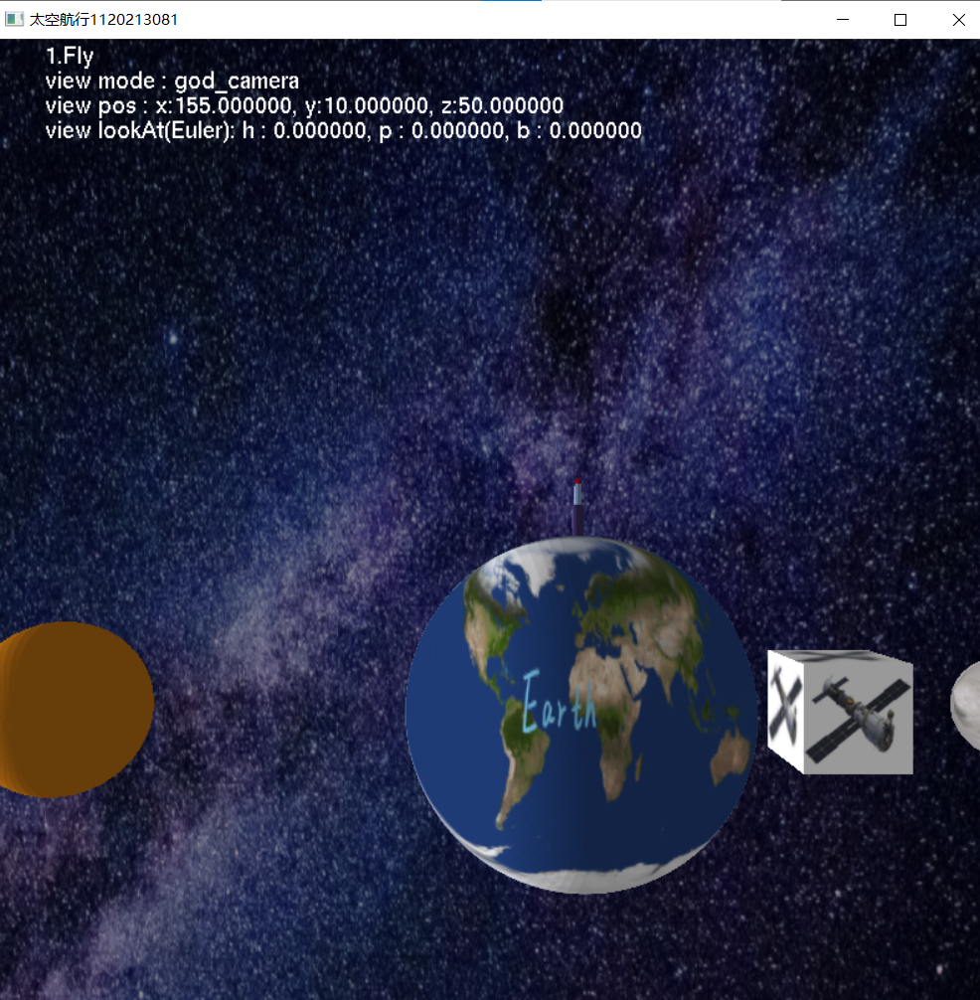
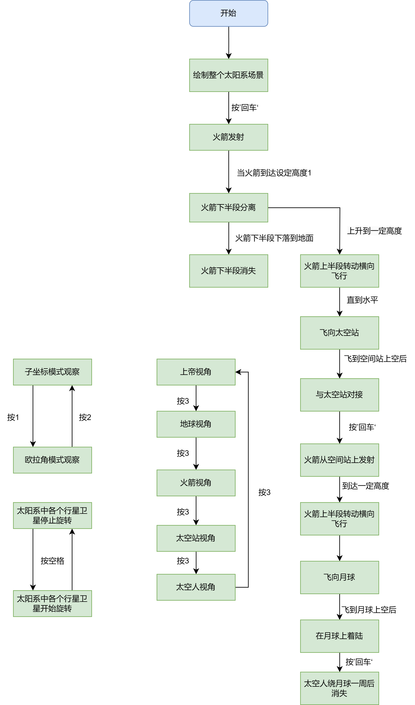

# 作业四说明文档

撰写人：1120213081 介应奇

## 程序使用说明

### 功能介绍

本程序实现了如下功能：

1. 使用光照

   太阳中心设置为点光源；

   场景中绘制的对象都要支持光照，环境光40%，漫射光60%。

2. 使用纹理

   自己设计纹理图片，每个图片上都要有文字；

   场景中绘制的对象支持纹理，计算正确纹理坐标；

   纹理与光照融合。

3. 支持2D文字显示

   屏幕左上角显示提示信息。提示当前状态、当前视点状态；

4. 使用天空盒

   绘制太空天空盒或者天空球包围整个场景；

   天空盒或者天空球内部贴太空纹理模拟银河系。

5. 模型部分

   地球、月球、太阳使用光照和纹理；

   增加空间站；

   空间站自动围绕地球飞行；

   空间站支持光照和纹理；

   增加太空人平时坐在火箭中，登月后可在月球行走；

   太空人支持光照和纹理。

6. 视点对多对象的绑定。

   地球视点、火箭视点、空间站视点、太空人视点；

   每个视点都可以使用1,2选择子坐标模式和欧拉角模式；

   这5种视点可以用’3’键进行循环切换。切换过程中实现动态插值；

   视点使用类编程实现，要记录每个视点当前状态和位置姿态等信息，下次切换回来时候使用。

7. 动作部分。

   每次按“回车”键开始下个动作；

   回车

   1）火箭发射

   起飞后首先脱落一级火箭，然后飞向空间站。

   2）实现火箭与空间站自动对接。

   当火箭距离空间站距离近的时候，开始进入停靠程序。屏幕提示信息显示当前对接距离；

   火箭尾部与空间站连接；

   对接后火箭随着空间站同步运动。

   回车

   3）火箭离开空间站飞向月球

   4）火箭在月球着陆

   着陆过程类似对接，火箭尾部与月球连接；

   屏幕提示信息显示当前着陆距离

   回车

   5）月球行走

   太空人在月球表面自动行走一周

### 操作说明

1. 开始运行：双击运行`"图形学4_1120213081_介应奇\Euler_Quat\run\Euler_Quat.exe"`

2. 使用键盘’1’设置为欧拉角方式视点控制；

   键盘’2’设置为自由漫游方式视点控制；

   使用键盘’a/d/w/s/q/e’控制视点的平移，分别对应左右上下前后；

   使用键盘’j/l/i/k/u/o’控制视点旋转，对应左右上下和滚动旋转；

   使用 ‘[’ 和‘]’提高/降低视点移动速度；

   使用 ‘{’ ‘}’ 提高/降低视点旋转速度；

3. 键盘’3’键在5中视点模式中切换，当前相机模式会在屏幕左上角显示；

4. 按‘空格’可切换行星卫星是否旋转移动，每次接受空格后会在运动和不运动之间切换；

5. 火箭动作控制

   1. 第一次按回车键火箭从地球上发射，与空间站对接，这个流程无需控制，键盘也不再接受回车，当对接完毕后
   2. 第二次按回车键火箭从空间站上发射，最终着陆在月球上
   3. 第三次按回车键太空人在月球上环绕一周后回到火箭上消失

### 运行截图

初始绘制结果：



## 程序设计说明

### 程序流程图



### 关键函数说明

这里只列出了本次作业中新增的一些类或修改较大的关键函数

1. `camera类`：这些函数实现了相机的基本功能，包括位置移动、视角旋转、自动移动和切换视点模式等。通过调用这些函数，可以控制相机在3D空间中的位置和视角。

   通过声明一个模型类指针为参数，实现了方便地相机位置的绑定

   ```c++
   pos：表示相机相对于父矩阵的位置。
   rspeed：旋转速度。
   mspeed：移动速度。
   mode：视点模式，受模式1控制，受模式0控制，不受控制。
   view：指向视角的指针。
   path：指向路径点的指针。
   path_pos：路径数组的下标。
   path_num：路径点的总数。
   view_num：视角点的总数。
   view_pos：视角数组的下标。
   elookAt：表示相机的目标视点的欧拉角。
   mlookAt：表示相机的目标视点的变换矩阵。
   parentModel：指向父模型的指针。
   camera::camera()默认构造函数，设置了一些默认参数和初始值。
   camera::camera(CVector081 p, CEuler081 e, int m)构造函数，接收位置、欧拉角和视点模式作为参数，并设置相应的成员变量。
   camera::camera(CVector081 p, int m, CMatrix081 M)构造函数，接收位置、视点模式和父矩阵作为参数，并设置相应的成员变量。
   camera::camera(CVector081 p, int m)构造函数，接收位置和视点模式作为参数，并设置相应的成员变量。
   camera::Set_inter_path(CVector081* interpolation_pos, int num)设置插值路径，接收位置数组和位置点位数作为参数。
   camera::Set_inter_view(CQuaternion081* interpolation_views, int num)设置插值视角，接收视角数组和视角点位数作为参数。
   camera::auto_move()自动移动相机位置和视角的函数，根据设置的路径和视角变化进行自动在插值轨迹上移动，并返回移动完成的状态。
   camera::getAbsPos()获取相机的绝对位置，考虑了父矩阵的影响。
   camera::switch_mode(int m)切换视点模式，接收模式值作为参数。
   camera::move_w()向上移动相机位置。
   camera::move_s()向下移动相机位置。
   camera::move_a()向左移动相机位置。
   camera::move_d()向右移动相机位置。
   camera::move_q()向前移动相机位置。
   camera::move_e()向后移动相机位置。
   camera::rotate_i()绕x轴正方向旋转相机视角。
   camera::rotate_k()绕x轴负方向旋转相机视角。
   camera::rotate_j()绕y轴正方向旋转相机视角。
   camera::rotate_l()绕y轴负方向旋转相机视角。
   camera::rotate_u()绕z轴正方向旋转相机视角。
   camera::rotate_o()绕z轴负方向旋转相机视角。
   camera::eulerRotate()根据欧拉角更新视角矩阵。
   ```

2. `CModel类`：

   ```C++
   pos：表示模型在其自身坐标系中的位置。
   parentModel：指向父模型的指针，用于实现模型的层次结构和相对位置的计算。
   size：表示模型的尺寸，包括长、宽和高。
   texture：存储纹理的变量。
   self_rotate：表示模型自身的旋转角度，使用欧拉角制表示。
   R：如果模型需要绕行半径为 R 的圆周运动，则记录其半径。
   self_rotate_axis：表示模型自身旋转的轴向。
   color：表示模型的颜色，使用 RGB 值表示。
   int LoadGLTextures(char* img_path)：加载纹理图片并转换为纹理的函数。
   void DrawBox()：绘制一个单位盒子的函数。
   void setColor(float r, float g, float b)：设置模型的颜色的函数。
   void setSize(float x, float y, float z)：设置模型的尺寸的函数。
   void setSize(float r)：设置模型的尺寸的函数。
   CVector081 getAbsPos()：获取模型的绝对位置的函数。
   void Draw(int mode)：根据不同的模式绘制模型的函数，里面继承了本程序场景中需要的各种模型绘制类型，光照贴图、无贴图球体，贴图正方体，火箭，大小会根据该模型设置的size属性决定
   ```

3. `miniEngine`：利用glut库、glew库、CMatrix081、CVector081、CQuaternion081、CEuler081、CModel、camera类实现绘制和流程控制，视点控制的主逻辑部分

   ```C++
   void myKeyboardFunc(unsigned char key, int x, int y)回调函数检测键位按下，当按下某个键的时候将这个键位的数组中的值设为真
   void myKeyboardUpFunc(unsigned char key, int x, int y)回调函数检测键位抬起，当按下某个键的时候将这个键位的数组中的值设为假
   void responseAllKey()循环扫描所有键位状态数组，当维真时执行相应的操作，实现流畅的多键位同时相应
   void Font2D(char* str, double x, double y, int size)在屏幕的x，y位置上输出二维白色的str里存储的的字符，只支持英文
   void updateRocket()根据当前按下的回车的数量选择进入不同的行为模式逻辑，执行相应的动作，太空人的更新逻辑也在这里面
   void updatePlanet()利用极坐标系求出下一帧星球旋转后的位置
   void updateView()控制当前使用的相机是插值相机还是可以自主控制的相机模式，同时完成相机的交替
   void initLight()初始化光照设置
   void initModelData()初始化模型的自身基本属性，例如大小，颜色，火箭的朝向，行星和卫星的绕行半径，模型自身的父矩阵
   void initModelPos()根据初始化过的模型自身的基本属性确定模型在自身坐标系中的位置
   void initCamera()创建所有的相机，将这些相机加入到全局变量向量中，方便在全局中调用，将相机绑定到对应的模型上，初始化相机在子坐标系中的相对位置，方便观察
   ```

### 设计思路说明

#### 明确任务的定位

我们在图形学中要绘制一个场景，实现各种各样的物体动作控制逻辑需要利用向量和方位角的相关的数据结构来存储好具有我们赋予了实际意义的数据，在场景建模和布局模块对这些数据进行计算，然后交给OpenGL的渲染管线进行渲染最终绘制出结果，我们的程序事实上就是在完成这个部分的设置，而具体在这次的作业中我的工作重点在于将代码用面向对象编程的模式进行了重整。

#### 组织代码的思路

1. 类设计思路：因为场景的模型和相机都有很多个，而且他们之间还需要有附着关系，因此我们考虑将所有需要绘制的物体都抽象为一个模型类，模型类中有需要绘制的所有属性，包括位置，父模型等等，同时模型类也提供了绘制的接口，只要调用了绘制就可以直接在对应位置绘制设定属性的模型了，实现了对模型的整合，减少了大量全局变量的声明；而相机也是如此相机的控制变量和方法都组织在了类里，因此相机之间的切换、绑定视点和插值等操作也会变得方便。
2. 绑定功能：模型类和相机类的绝对位置信息一律通过自身坐标和父模型位置来确定，自身只存储模型在自身坐标中的位置和模型指针，绝对位置是通过调用`getAbsPos()`函数根据两个基本的位置信息得出的，因此模型的位置可以实现绑定的效果，相机同理。
3. 贴图和光照：当我们使用的贴图本身的颜色就是我们想要的物体的颜色的时候，我们需要将物体本身的颜色设置为白色，这样物体的颜色才全都是贴图上呈现的颜色，这种情况下我们再使用物体本身的颜色和贴图颜色相乘模式得出的结果就是既有光照又有正常的贴图颜色的效果了，也就是说我们的物体一开始不赋予颜色，只等最后一步贴图和光照结果颜色相乘即可，也就是把光照效果和颜色两部分分开计算，然后乘在一起就是我们理想的结果了。
4. 火箭动作设计思路：抽象的来看，所有的火箭动作需求都是要求一个模型在另一个模型的子坐标空间中完成一些动作，然后切换到另一个子坐标系中完成一些动作，因此我们只需要完成火箭在子坐标系中动作的设定，并且实现火箭位置在两个子坐标系中的切换即可，动作通过位置向量和速度向量即可实现，切换则是在飞到指定的模型上空后将父模型指针换绑即可，然后同时将模型此时的位置是在新的父模型中的位置计算出来更新即可。

